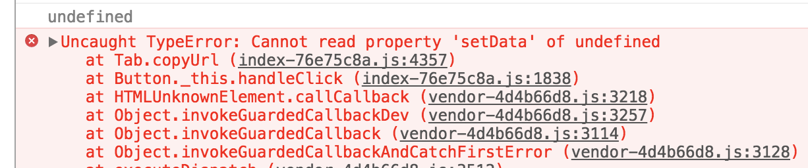
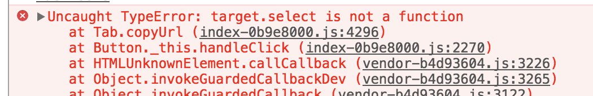
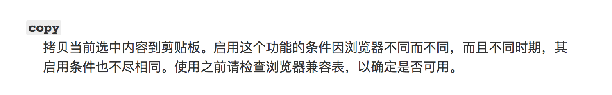

### 一键复制


* clipboardData

```javascript

let copyUrl = (video) => {
  window.clipboardData.setData("Text", video)
}

~~~
<Button type="primary" data-url={video} onClick={copyUrl}>一键copy 视频地址</Button>
```

报错  



* select()

```javascript
copyUrl () {
  let target = this.videoUrl
  target.select()
  document.execCommand("Copy")
}

~~~

<p> 视频真实地址 <span ref={ node => this.videoUrl = node } > {video} </span> </p>


```

select() 方法用于选择该元素中的文本

报错




之后发现是因为 select() 方法不能用于普通元素 然后将其更改为input 或者 textarea 元素 就可以啦

但是这个浏览器的兼容性真的是 emmm~~



也就是时灵时不灵 一切看情况


* zeroclipboard

[github](https://github.com/zeroclipboard/zeroclipboard)
